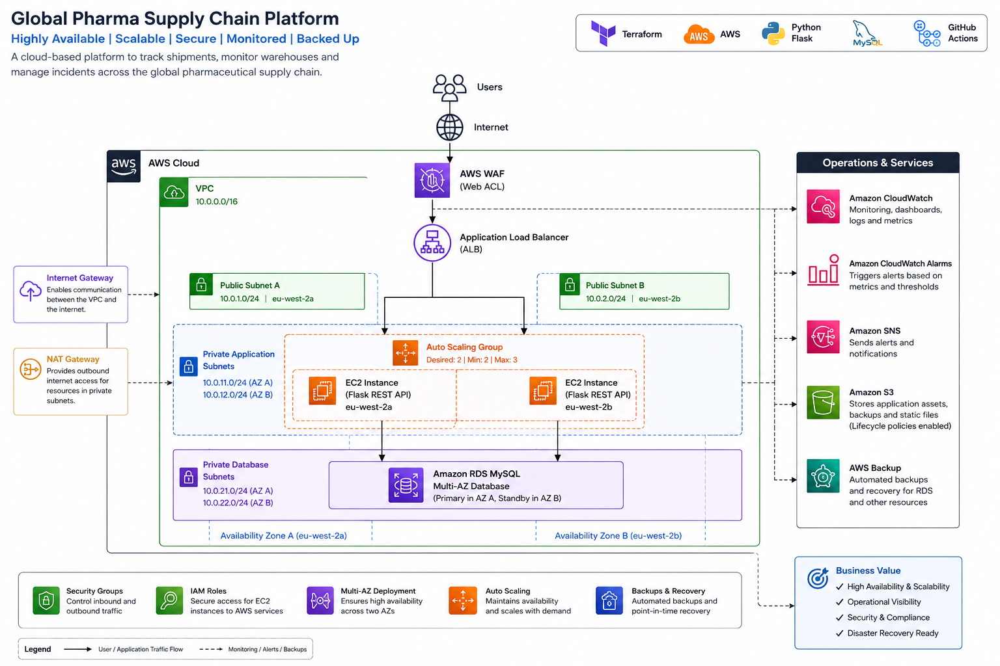
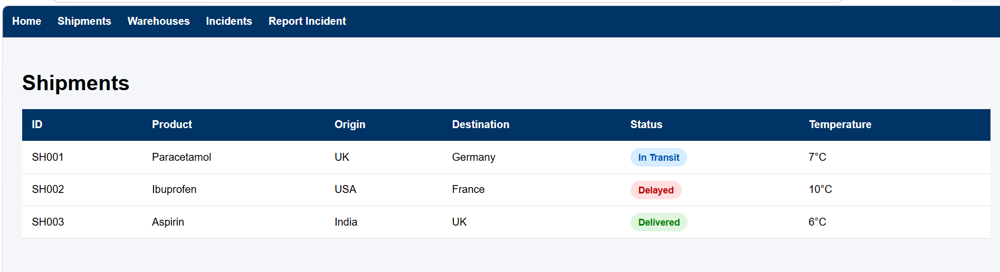
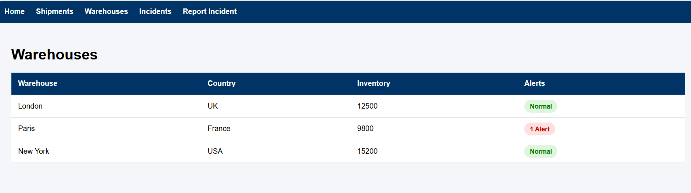
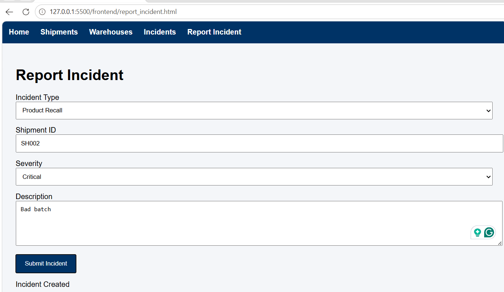
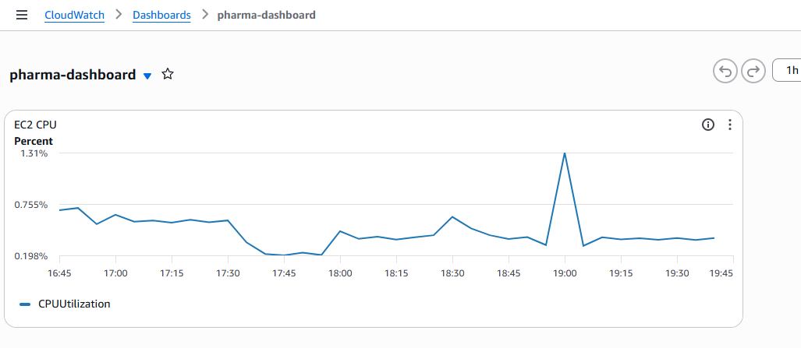

# Global Pharma Supply Chain Platform

A cloud-based supply chain visibility and incident management solution designed to support the movement of pharmaceutical products across global distribution networks.

The platform provides operational teams with a centralised view of shipments, warehouse inventory, and supply chain incidents while leveraging AWS cloud services to deliver scalability, resilience, monitoring, security, and automated infrastructure management.

---

# Solution Overview

Pharmaceutical supply chains operate across multiple facilities, countries, and transportation networks. Delays, temperature excursions, inventory shortages, and operational incidents can significantly impact product availability and regulatory compliance.

The Global Pharma Supply Chain Platform addresses these challenges by providing:

* Real-time shipment visibility
* Warehouse inventory monitoring
* Operational incident management
* Centralised reporting
* Automated monitoring and alerting
* High-availability cloud infrastructure
* Backup and recovery capabilities

---

# Architecture



The solution is deployed within AWS using a multi-tier architecture consisting of:

* Application Load Balancer (ALB)
* Auto Scaling Group (ASG)
* Amazon EC2
* Amazon RDS MySQL
* Amazon CloudWatch
* Amazon SNS
* Amazon S3
* AWS Backup
* AWS WAF

---

# Core Capabilities

## Shipment Tracking

Provides visibility into pharmaceutical shipments, including:

* Shipment ID
* Product Information
* Origin and Destination
* Shipment Status
* Transportation Temperature

### Shipment Dashboard



Frontend source:

```text
frontend/shipments.html
```

---

## Warehouse Monitoring

Provides visibility into warehouse operations and inventory levels.

Capabilities include:

* Inventory tracking
* Warehouse status monitoring
* Operational alert visibility

### Warehouse Dashboard



Frontend source:

```text
frontend/warehouses.html
```

---

## Incident Management

Allows operational teams to record and review supply chain disruptions.

Examples include:

* Shipment Delays
* Product Recalls
* Temperature Excursions
* Logistics Disruptions

### Incident Management



Frontend source:

```text
frontend/incidents.html
frontend/report_incident.html
```

---

# Operational Monitoring

Amazon CloudWatch provides visibility into infrastructure performance and operational health.

Current monitoring includes:

* EC2 CPU Utilisation
* Infrastructure Health Monitoring
* Alerting through Amazon SNS

### CloudWatch Dashboard



Terraform source:

```text
terraform/cloudwatch.tf
```

---

# High Availability & Scalability

The platform is designed to support operational continuity through:

* Application Load Balancer
* Auto Scaling Group
* Health Checks
* Multi-Subnet Deployment

Benefits:

* Improved resilience
* Automated instance replacement
* Traffic distribution across application instances

Terraform source:

```text
terraform/alb.tf
terraform/asg.tf
```

---

# Security

Security controls implemented within the solution include:

* Network Segmentation
* Private Application Subnets
* Private Database Subnets
* Security Groups
* AWS WAF Protection
* IAM Roles
* AWS Systems Manager Session Manager

Terraform source:

```text
terraform/security_groups.tf
terraform/waf.tf
terraform/iam.tf
```

---

# Backup & Recovery

Business continuity capabilities include:

* AWS Backup
* Automated Recovery Points
* S3 Lifecycle Management

Terraform source:

```text
terraform/backup.tf
terraform/s3.tf
```

---

# Technology Stack

## Cloud Platform

* Amazon Web Services (AWS)

## Infrastructure as Code

* Terraform

## Backend

* Python
* Flask
* PyMySQL

Backend source:

```text
app/app.py
```

## Frontend

* HTML
* CSS
* JavaScript

Frontend source:

```text
frontend/
```

## Database

* Amazon RDS MySQL

## CI/CD

* GitHub Actions

Pipeline source:

```text
.github/workflows/terraform.yml
```

---

# Infrastructure Components

Terraform configuration is organised across dedicated infrastructure modules:

```text
terraform/
├── vpc.tf
├── subnets.tf
├── route_tables.tf
├── private_route_tables.tf
├── igw.tf
├── nat.tf
├── security_groups.tf
├── alb.tf
├── alb_attachment.tf
├── ec2.tf
├── asg.tf
├── rds.tf
├── cloudwatch.tf
├── sns.tf
├── s3.tf
├── backup.tf
├── waf.tf
├── iam.tf
├── variables.tf
├── outputs.tf
└── user_data.sh
```

---

# CI/CD Pipeline

GitHub Actions automatically performs infrastructure validation on every code push.

Pipeline stages:

* Terraform Init
* Terraform Format Validation
* Terraform Validate

Workflow source:

```text
.github/workflows/terraform.yml
```

---

# Key Outcomes

* Designed and deployed a cloud-native pharmaceutical supply chain management solution.
* Implemented highly available application architecture using Application Load Balancer and Auto Scaling Groups.
* Developed REST API services using Flask and Python.
* Integrated Amazon RDS MySQL for operational data storage.
* Implemented monitoring, alerting, backup, and security controls.
* Automated infrastructure provisioning using Terraform.
* Implemented CI/CD validation using GitHub Actions.

---

# Repository Structure

```text
global-pharma-supply-chain-platform/

├── app/
│   └── app.py
│
├── frontend/
│   ├── index.html
│   ├── shipments.html
│   ├── warehouses.html
│   ├── incidents.html
│   ├── report_incident.html
│   ├── script.js
│   └── styles.css
│
├── terraform/
│   └── *.tf
│
├── screenshots/
│   ├── architecture-diagram.png
│   ├── shipments-dashboard.png
│   ├── warehouses-dashboard.png
│   ├── incidents-dashboard.png
│   └── cloudwatch-dashboard.png
│
└── README.md
```
